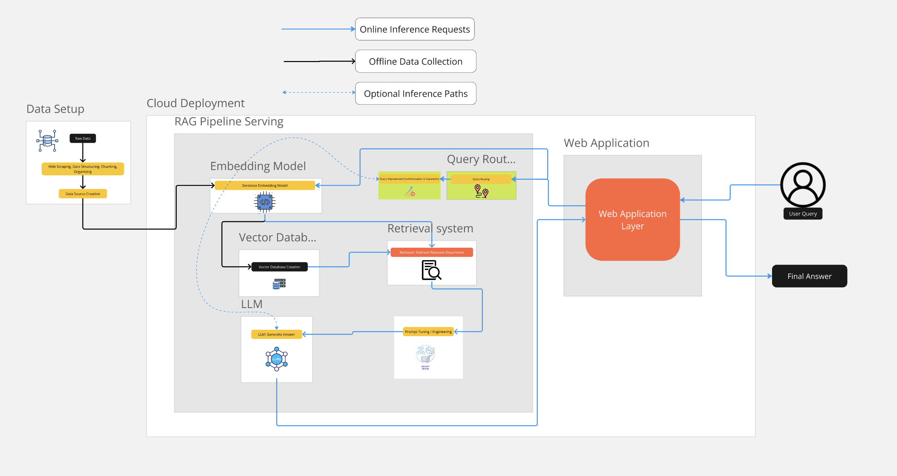

# METUBOT Kizir-AI
MetuBOT is an intelligent chatbot designed to provide course recommendations and academic regulation support for students and prospective students of the Informatics Institute. Whether you are exploring courses or need guidance on academic policies, MetuBOT is here to assist.

## Table of Contents
1. [Introduction](#introduction)
2. [Features](#features)
3. [Installation](#installation)
4. [METUBOT Demo](#metubot-demo)
5. [Architecture](#architecture)
6. [File Structure](#file-structure)

## Introduction
MetuBOT is specifically designed for the students and prospective students of the Informatics Institute to:

Simplify course selection by recommending the most relevant courses based on interests and academic goals.
Provide instant, accurate answers to academic regulation questions.
Assist prospective students in understanding program requirements and planning their studies effectively.


## Features

Personalized Course Recommendations: Suggests courses based on students' interests, program and course requirements.
Academic Regulation Support: Answers queries about Informatics Institute's academic policies, deadlines, and procedures.
Dynamic Knowledge Base: Keeps up-to-date with the latest academic regulations and course information

## Installation

MetuBOT is containarized system which can be easily installed using dockerfile or pulling the necessary docker image
```
docker pull kizirai/metubot:1.0
git clone https://github.com/safak17/kizir-ai.git
cd kizir-ai
chmod +x start.sh
bash start.sh
```

## METUBOT Demo


## Architecture


## File Structure
```plaintext
.
├── LICENSE
├── README.md
├── analysis
│   └── eda.ipynb
├── data
│   ├── cleaned
│   └── merged
├── media
│   └── output.gif
├── rag
│   ├── __pycache__
│   │   └── rag_simple.cpython-310.pyc
│   ├── deepeval_evaluate.py
│   ├── deepeval_evaluate_gguf.py
│   ├── download_model.sh
│   ├── faiss_index
│   │   ├── __init__.py
│   │   ├── index.faiss
│   │   └── index.pkl
│   ├── llm_async_fastapi.py
│   ├── rag_evaluator.py
│   ├── rag_performance_metrics.py
│   ├── rag_qa.py
│   ├── rag_simple.py
│   └── vector_database_creator.py
├── scrape
│   ├── img
│   │   └── scraped_data.png
│   ├── merge_scraped_data.ipynb
│   ├── requests_scraper.py
│   ├── scrape_catalog_metu_all_courses.py
│   ├── scrape_catalog_metu_course_contents.py
│   └── selenium_scraper.ipynb
├── start.sh
└── ui
    ├── app.py
    ├── config.toml
    ├── llm_simulator.py
    ├── logo.png
    ├── main.py
    └── run_bash.bat

```


